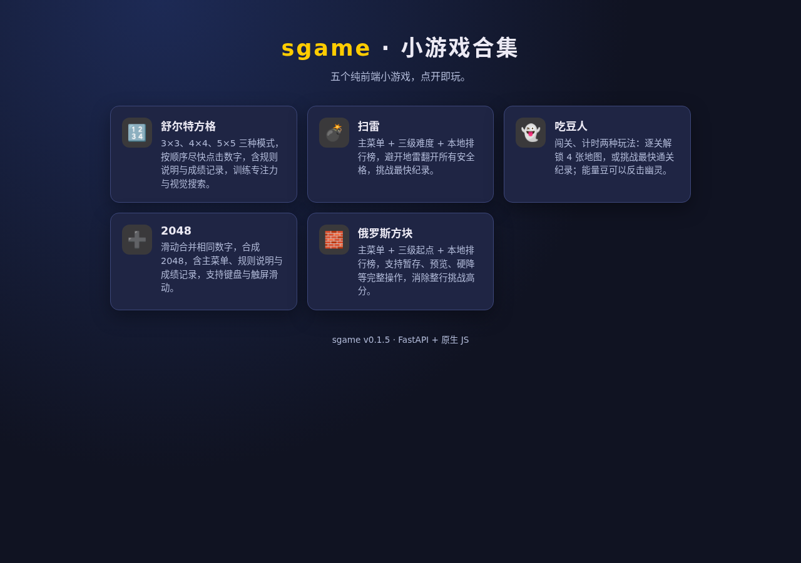
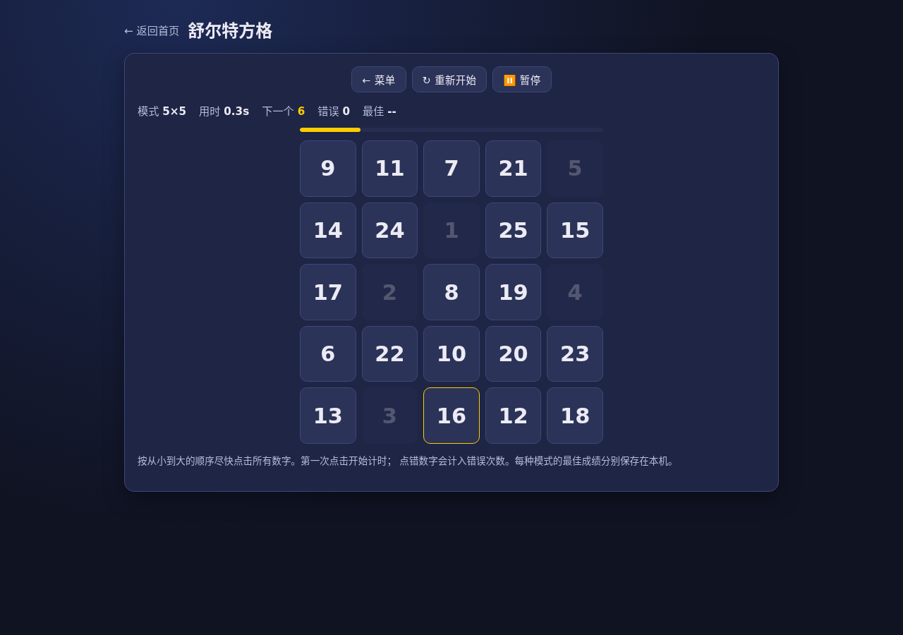
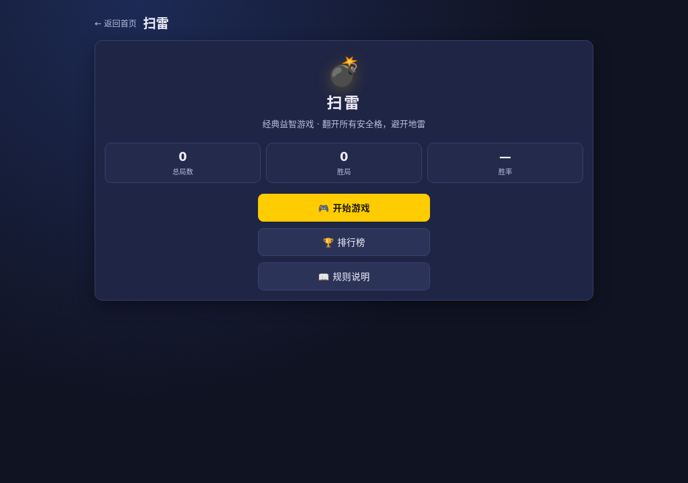
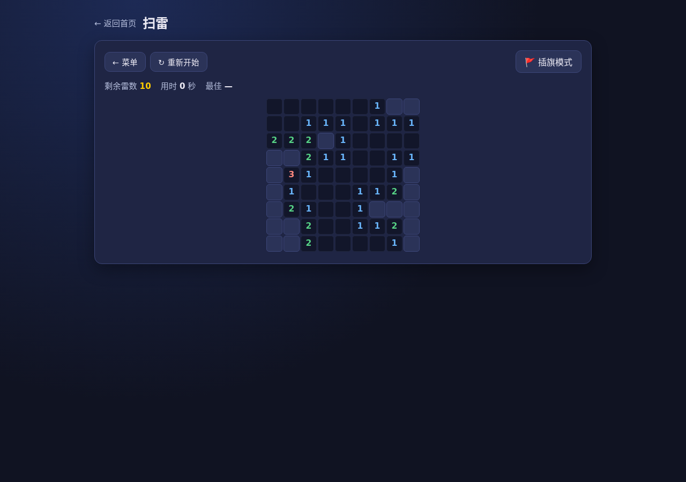
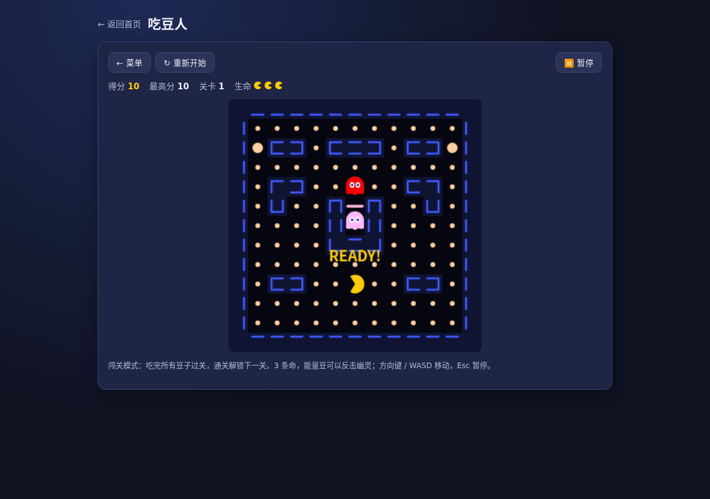
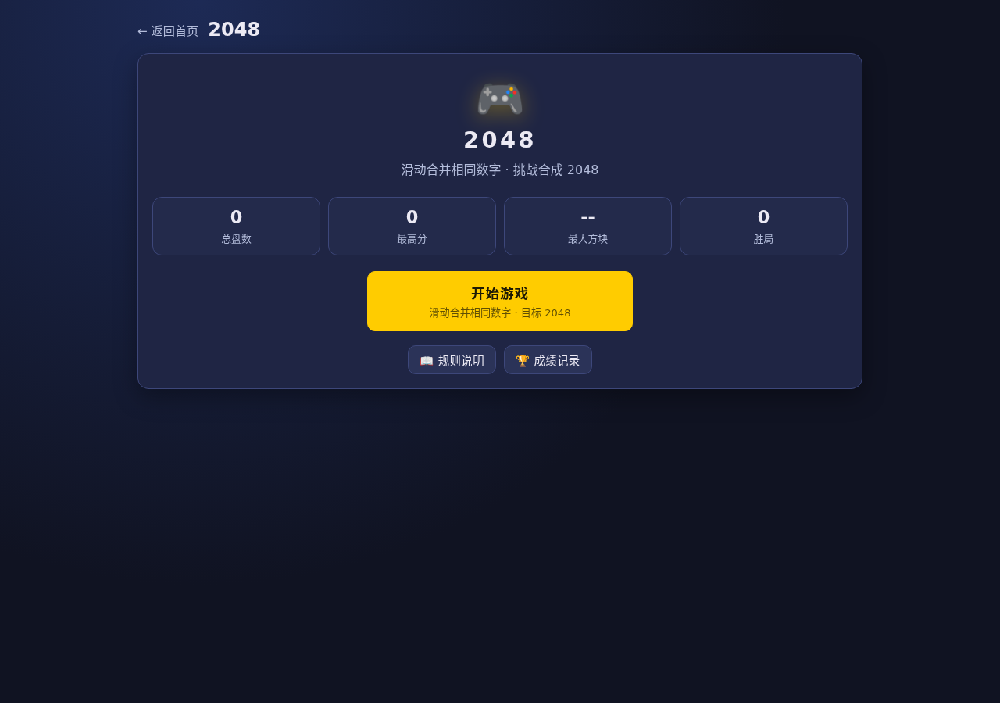
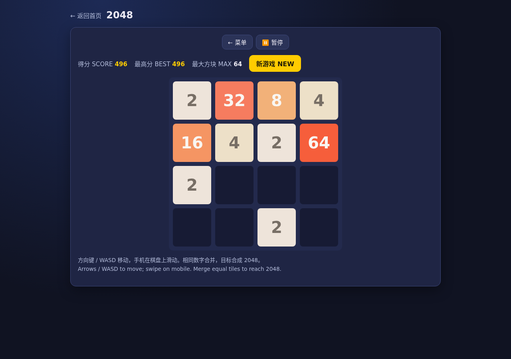
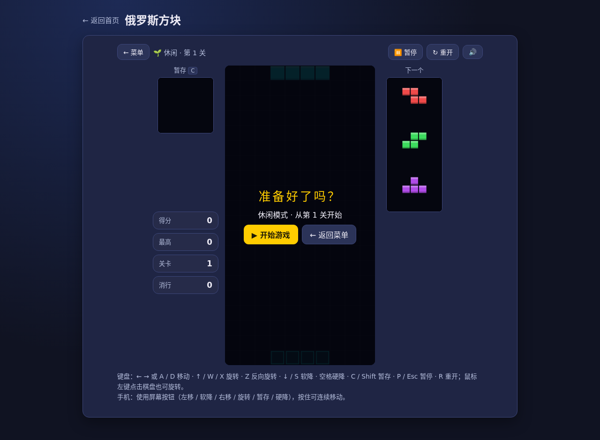
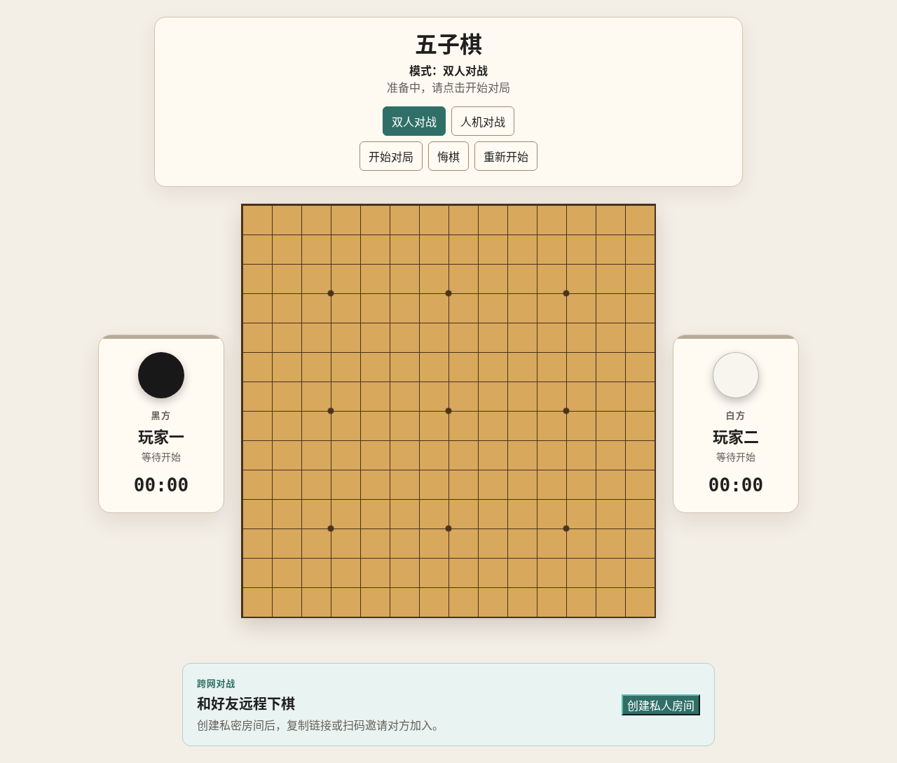

# MacApps

个人小游戏合集仓库，包含两个可独立运行的项目：

- **[sgame](./sgame)** — 五款纯前端小游戏合集：舒尔特方格、扫雷、吃豆人、2048、俄罗斯方块，浏览器点开即玩，支持 PWA 离线访问。
- **[gomoku](./gomoku)** — 15×15 五子棋：本地双人、人机对战（三级 AI）、私人跨网对战，提供 Pygame 桌面版与 Web 版。

## 预览

### sgame 游戏首页



### 舒尔特方格

| 主菜单 | 游戏界面 |
|:---:|:---:|
|  |  |

### 扫雷

| 主菜单 | 游戏界面 |
|:---:|:---:|
|  |  |

### 吃豆人

| 主菜单 | 游戏界面 |
|:---:|:---:|
|  |  |

### 2048

| 主菜单 | 游戏界面 |
|:---:|:---:|
|  |  |

### 俄罗斯方块

| 主菜单 | 游戏界面 |
|:---:|:---:|
|  |  |

### gomoku 五子棋



## sgame — 小游戏合集

### 安装

```bash
conda activate sgame
pip install -r sgame/requirements.txt
```

### 本地游玩

```bash
python sgame/scripts/run_server.py
```

在浏览器打开 <http://127.0.0.1:8001>，从首页选择游戏进入。五个游戏均为纯前端实现，无需后端存储，成绩与进度保存在浏览器本地。

### 公网访问

首次使用先安装 Cloudflare 客户端（例如从包管理器或官方发布页下载二进制），然后运行：

```bash
python sgame/scripts/run_quick_tunnel.py
```

终端会输出一个 `https://*.trycloudflare.com` 地址，任意设备打开即可访问。注意终端必须一直保持运行，且每次重启都会生成新地址。

### 游戏说明

#### 舒尔特方格

提供 3×3（1-9）、4×4（1-16）、5×5（1-25）三种模式，方格中随机分布数字，按顺序尽快点击所有数字。第一次点击开始计时，点错会记录错误次数。完成时显示用时和错误次数，每种模式的最佳成绩分别保存在浏览器本地存储中。主菜单提供开始游戏与战绩统计，游戏内支持暂停和完成结算面板，另有规则说明弹窗与成绩记录页（各模式最佳成绩、最近 20 条记录，可清空）。

#### 扫雷

经典扫雷，主菜单包含开始游戏、排行榜、规则说明与个人战绩（总局数 / 胜局 / 胜率）：

- 初级：9×9，10 个地雷
- 中级：16×16，40 个地雷
- 高级：16×30，99 个地雷

进入游戏后：左键翻开格子，右键（或开启插旗模式、手机长按）插旗，工具栏提供独立的「重新开始」按钮。第一次点击保证安全。点击已翻开的数字且周围旗数匹配，可一次翻开周围剩余格子。胜利用时自动计入本地排行榜（每种难度保存最快前十名）。

#### 吃豆人

经典街机吃豆人，主菜单提供三种模式：

- 闯关模式：共 4 个挑战关卡，地图越来越大、幽灵越来越多（2→3→4→4 只）；通关当前关卡后解锁下一关，进度与每关最佳得分保存在浏览器本地存储中。每局 3 条命。
- 计时模式：一口气打通全部 4 关，用时越短越好；撞到幽灵不扣命，但每次 +3 秒惩罚。成绩计入本地排行榜（最快前十名）。
- 限时模式：地图尚未设计，敬请期待。

操作：方向键 / WASD 移动，手机上在画面内滑动；Esc 或 P 暂停（切走页面自动暂停）。吃到能量豆后幽灵变蓝，可以吃掉它们。最高分保存在浏览器本地存储中。

#### 2048

经典 4×4 数字合并游戏。方向键 / WASD 移动，手机上滑动操作。相同数字合并，目标合成 2048。最高分保存在浏览器本地存储中，达到 2048 后可选择继续。主菜单提供开始游戏与战绩统计（总盘数 / 最高分 / 最大方块 / 胜局），游戏内支持暂停、结算浮层（含新纪录提示）与误触确认，另有规则说明弹窗与成绩记录页（每局结果、得分、最大方块、步数，最近 20 条，可清空）。

#### 俄罗斯方块

经典落下式拼块游戏，拥有完整的游戏 UI：主菜单（开始游戏 / 排行榜 / 规则说明 / 音效开关，含总局数、最高分、累计消行战绩）、起点关卡选择（休闲 Lv1 / 经典 Lv5 / 高手 Lv10）、对局界面（暂存 HOLD、下一个方块预览 ×3、幽灵落点、实时得分 / 关卡 / 消行）、暂停与游戏结束结算界面，以及每个起点关卡的本机前十名排行榜（可录入昵称）。

操作：

- 键盘：←/→ 或 A/D 移动（长按连续移动），↑/W/X 顺时针旋转，Z 逆时针旋转，↓/S 软降，空格硬降，C/Shift 暂存，P/Esc 暂停，R 重新开始，M 静音；鼠标左键点击棋盘旋转，右键反向旋转。
- 手机：屏幕按钮（左移 / 软降 / 右移 / 旋转 / 暂存 / 硬降），按住可连续操作。

规则：消除 1-4 行分别得 100 / 300 / 500 / 800 × 当前关卡；软降每格 +1 分，硬降每格 +2 分；每消除 10 行升 1 关并加快下落速度。方块落地后可暂存一次（取出时交换）。音效、战绩与排行榜均保存在浏览器本地存储中。

### PWA 离线支持

sgame 前端提供 manifest 与 Service Worker，首次访问后会缓存应用外壳，之后在离线状态下也能打开首页和已缓存的游戏页面（首次访问需联网）。所有成绩、记录与设置均使用 `localStorage` 按浏览器本地保存。

### 测试

```bash
pytest sgame/tests/
```

## gomoku — 五子棋

### 安装

```bash
conda activate gomoku
pip install -r gomoku/requirements.txt
```

### 本地游玩

Pygame 桌面版（本地双人或人机模式，支持 `Start Game` / `Restart` / `Undo`）：

```bash
python gomoku/scripts/run_pygame.py
```

Web 版（本地双人、人机、胜利棋线高亮、黑白双方累计用时、悔棋和重开，宽窄屏自适应布局）：

```bash
python gomoku/scripts/run_server.py
```

在浏览器打开 <http://127.0.0.1:8000>。人机模式可选择人类执黑、执白或随机棋色；AI 执黑时会在开始对局后自动走第一手。

### 跨网私人对战

Mac 和手机不需要在同一 Wi-Fi。首次使用先安装 Cloudflare 客户端：

```bash
brew install cloudflared
```

然后只运行：

```bash
python gomoku/scripts/run_quick_tunnel.py
```

终端会输出一个 `https://*.trycloudflare.com` 地址。Mac 和手机都打开该地址；由 Mac 创建私人房间，再把弹窗中的二维码或完整邀请链接发给对方。房主确认后开始对局，双方通过 WebSocket 实时同步；断线会暂停计时，重连后自动恢复。邀请链接带有随机密钥，不要公开发布公网地址或完整房间链接。

Quick Tunnel 适合临时私人对战。若要长期固定网址，需要自己的域名和 Cloudflare Named Tunnel，或部署到支持 HTTPS/WSS 的服务器。

### AI

当前提供三种 AI 难度：

- 「简单」使用规则型 SimpleAI：检查一步获胜与必须阻挡点（含带间隔的五连威胁），按连续四、三、二扩展己方或阻挡对方，并带中心倾向的兜底策略。参数集中在 `src/gomoku/ai/simple_ai_config.py`。
- 「普通」使用纯搜索 NormalAI：迭代加深 Negamax、Alpha-Beta/PVS 剪枝、Zobrist 哈希置换表、增量棋型静态评估、威胁优先候选点、有限深度 VCF 检测与动态时间分配。参数集中在 `src/gomoku/ai/normal_ai_config.py`。
- 「困难」使用战术引擎 + 蒙特卡洛树搜索的 HardAI：验证式 VCF/VCT 强制胜证明、逐点验证的战术防守与确定性 PUCT MCTS 兜底，共享硬时限、超时绝不当作落子。参数集中在 `src/gomoku/ai/hard_ai_config.py`，技术细节见 [gomoku/docs/hard_ai.md](gomoku/docs/hard_ai.md)。

可运行固定局面诊断或双配置确定性对战来比较 AI 参数：

```bash
python gomoku/scripts/benchmark_normal_ai.py
python gomoku/scripts/compare_normal_ai_configs.py \
  --config-a baseline.json --config-b candidate.json \
  --node-budget 2000 --output arena-report.json
```

Web 人机页面可展开「AI 调试信息」查看决策原因与前三候选；Pygame 可点击 `Export Position` 导出局面 JSON。更完整的 AI 设计说明见 [gomoku/README.md](gomoku/README.md)。

### 测试

```bash
python -m pytest gomoku/tests
```

## Docker

sgame 提供 Docker 镜像，在仓库根目录执行：

```bash
docker build -f sgame/Dockerfile -t sgame .
docker run -d -p 8001:8001 sgame
```

## 项目结构

```text
MacApps/
├── sgame/                          # 小游戏合集（FastAPI + 原生 JS）
│   ├── frontend/                   # 前端页面与各游戏实现
│   │   ├── index.html              # 游戏首页
│   │   ├── style.css / pwa.js      # 全局样式与 PWA 注册
│   │   ├── manifest.webmanifest / sw.js / icon.svg
│   │   ├── schulte/                # 舒尔特方格
│   │   ├── minesweeper/            # 扫雷
│   │   ├── pacman/                 # 吃豆人
│   │   ├── 2048/                   # 2048
│   │   └── tetris/                 # 俄罗斯方块
│   ├── scripts/                    # run_server.py / run_quick_tunnel.py
│   ├── tests/                      # 服务端测试
│   └── Dockerfile
├── gomoku/                         # 五子棋（pygame + FastAPI/WebSocket）
│   ├── frontend/                   # Web 版页面
│   ├── scripts/                    # 桌面版 / 服务器 / 隧道 / AI 基准脚本
│   ├── tests/
│   └── CHANGELOG.md
├── src/
│   ├── sgame/                      # sgame 服务端
│   │   ├── config.py               # 服务配置
│   │   └── server/app.py           # FastAPI 应用
│   └── gomoku/                     # 五子棋核心逻辑与服务端
│       ├── core/                   # 棋盘、规则与对局状态机
│       ├── ai/                     # SimpleAI / NormalAI 及配置
│       ├── server/                 # FastAPI + WebSocket 房间服务
│       └── adapters/               # 桌面 / Web 适配层
└── docs/screenshots/               # 本 README 使用的截图
```

## 环境说明

两个项目各自使用独立的 conda 环境（`sgame` 与 `gomoku`），依赖互不冲突。sgame 服务默认监听 `127.0.0.1:8001`，gomoku 服务默认监听 `127.0.0.1:8000`，可通过 `SGAME_HOST` / `SGAME_PORT` 与 `GOMOKU_HOST` / `GOMOKU_PORT` 环境变量调整。
